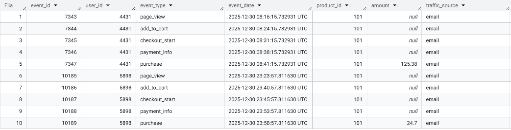
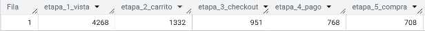
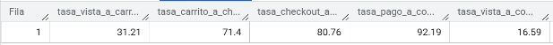
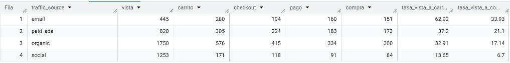
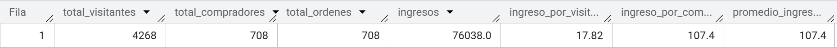

# 📊 Análisis de Embudo de Ventas — E-commerce

Análisis completo del embudo de conversión de una tienda e-commerce usando **BigQuery (Google SQL)**.

---

## 🗂️ Estructura del repositorio

```
📁 embudo-ventas-sql/
├── embudo_ventas.sql        # Consultas SQL del análisis
├── user_events.csv          # Dataset (9,381 registros)
├── README.md                # Documentación del proyecto
└── 📁 screenshots/
    ├── 01_exploracion.png
    ├── 02_embudo_etapas.png
    ├── 03_tasas_conversion.png
    ├── 04_canales_trafico.png
    └── 05_ingresos.png
```

---

## 📁 Dataset

| Campo | Tipo | Descripción |
|---|---|---|
| `event_id` | INT | ID único del evento |
| `user_id` | INT | ID del usuario |
| `event_type` | VARCHAR | Etapa del embudo |
| `event_date` | DATETIME | Fecha y hora del evento |
| `product_id` | INT | ID del producto |
| `amount` | DECIMAL | Monto de la compra |
| `traffic_source` | VARCHAR | Canal de origen |

---

## 🔍 Análisis realizados

### 1. Exploración inicial
Vista previa del dataset e identificación de las etapas del embudo.

```sql
SELECT * FROM `practicasql-489521.embudo_ventas.embudo` LIMIT 10;

SELECT DISTINCT event_type 
FROM `practicasql-489521.embudo_ventas.embudo`;
```



---

### 2. Embudo de conversión
Cantidad de usuarios únicos en cada etapa del proceso de compra en los últimos 30 días usando `COUNT DISTINCT` y `CASE WHEN`.

```sql
WITH etapas_embudo AS (
    SELECT
        COUNT(DISTINCT CASE WHEN event_type = 'page_view' THEN user_id END) AS etapa_1_vista,
        COUNT(DISTINCT CASE WHEN event_type = 'add_to_cart' THEN user_id END) AS etapa_2_carrito,
        COUNT(DISTINCT CASE WHEN event_type = 'checkout_start' THEN user_id END) AS etapa_3_checkout,
        COUNT(DISTINCT CASE WHEN event_type = 'payment_info' THEN user_id END) AS etapa_4_pago,
        COUNT(DISTINCT CASE WHEN event_type = 'purchase' THEN user_id END) AS etapa_5_compra
    FROM `practicasql-489521.embudo_ventas.embudo`
    WHERE event_date >= TIMESTAMP_SUB((SELECT MAX(event_date) FROM `practicasql-489521.embudo_ventas.embudo`), INTERVAL 30 DAY)
)
SELECT * FROM etapas_embudo;
```



---

### 3. Tasas de conversión
Porcentaje de usuarios que avanzan entre cada etapa y tasa de conversión total con `ROUND` y divisiones entre CTEs.

```sql
WITH etapas_embudo AS (
    SELECT
        COUNT(DISTINCT CASE WHEN event_type = 'page_view' THEN user_id END) AS etapa_1_vista,
        COUNT(DISTINCT CASE WHEN event_type = 'add_to_cart' THEN user_id END) AS etapa_2_carrito,
        COUNT(DISTINCT CASE WHEN event_type = 'checkout_start' THEN user_id END) AS etapa_3_checkout,
        COUNT(DISTINCT CASE WHEN event_type = 'payment_info' THEN user_id END) AS etapa_4_pago,
        COUNT(DISTINCT CASE WHEN event_type = 'purchase' THEN user_id END) AS etapa_5_compra
    FROM `practicasql-489521.embudo_ventas.embudo`
    WHERE event_date >= TIMESTAMP_SUB((SELECT MAX(event_date) FROM `practicasql-489521.embudo_ventas.embudo`), INTERVAL 30 DAY)
)
SELECT
    ROUND(etapa_2_carrito / etapa_1_vista * 100, 2) AS tasa_vista_a_carrito,
    ROUND(etapa_3_checkout / etapa_2_carrito * 100, 2) AS tasa_carrito_a_checkout,
    ROUND(etapa_4_pago / etapa_3_checkout * 100, 2) AS tasa_checkout_a_pago,
    ROUND(etapa_5_compra / etapa_4_pago * 100, 2) AS tasa_pago_a_compra,
    ROUND(etapa_5_compra / etapa_1_vista * 100, 2) AS tasa_vista_a_compra
FROM etapas_embudo;
```



---

### 4. Análisis por canal de tráfico
Rendimiento del embudo segmentado por `traffic_source` usando `GROUP BY` y CTEs.

```sql
WITH embudo_por_origen AS (
    SELECT 
        traffic_source,
        COUNT(DISTINCT CASE WHEN event_type = 'page_view' THEN user_id END) AS vista,
        COUNT(DISTINCT CASE WHEN event_type = 'add_to_cart' THEN user_id END) AS carrito,
        COUNT(DISTINCT CASE WHEN event_type = 'checkout_start' THEN user_id END) AS checkout,
        COUNT(DISTINCT CASE WHEN event_type = 'payment_info' THEN user_id END) AS pago,
        COUNT(DISTINCT CASE WHEN event_type = 'purchase' THEN user_id END) AS compra
    FROM `practicasql-489521.embudo_ventas.embudo`
    WHERE event_date >= TIMESTAMP_SUB((SELECT MAX(event_date) FROM `practicasql-489521.embudo_ventas.embudo`), INTERVAL 30 DAY)
    GROUP BY traffic_source
)
SELECT *,
    ROUND(carrito / vista * 100, 2) AS tasa_vista_a_carrito,
    ROUND(compra / vista * 100, 2) AS tasa_vista_a_compra
FROM embudo_por_origen
ORDER BY tasa_vista_a_compra DESC;
```



---

### 5. Análisis de ingresos
Ingresos totales, ticket promedio e ingreso por visitante y comprador con `SUM` y `COUNT`.

```sql
WITH ingresos_embudo AS (
    SELECT
        COUNT(DISTINCT CASE WHEN event_type = 'page_view' THEN user_id END) AS total_visitantes,
        COUNT(DISTINCT CASE WHEN event_type = 'purchase' THEN user_id END) AS total_compradores,
        COUNT(CASE WHEN event_type = 'purchase' THEN 1 END) AS total_ordenes,
        ROUND(SUM(CASE WHEN event_type = 'purchase' THEN amount END)) AS ingresos
    FROM `practicasql-489521.embudo_ventas.embudo`
    WHERE event_date >= TIMESTAMP_SUB((SELECT MAX(event_date) FROM `practicasql-489521.embudo_ventas.embudo`), INTERVAL 30 DAY)
)
SELECT *,
    ROUND(ingresos / total_visitantes, 2) AS ingreso_por_visitante,
    ROUND(ingresos / total_compradores, 2) AS ingreso_por_comprador,
    ROUND(ingresos / total_ordenes, 2) AS promedio_ingreso_orden
FROM ingresos_embudo;
```



---

## 📈 Resultados principales

| Métrica | Valor |
|---|---|
| Total visitantes | 4,268 |
| Total compradores | 708 |
| Ingresos totales | $76,038 |
| Ticket promedio | $107.40 |
| Tasa de conversión total | 16.59% |

### Tasas por etapa
| Etapa | Tasa |
|---|---|
| Vista → Carrito | 31.21% |
| Carrito → Checkout | 71.40% |
| Checkout → Pago | 80.76% |
| Pago → Compra | 92.19% |

### Rendimiento por canal
| Canal | Tasa vista → compra |
|---|---|
| Email | 33.93% ✅ |
| Paid Ads | 21.10% 🟡 |
| Organic | 17.14% 🟡 |
| Social | 6.70% ❌ |

---

## 🛠️ Tecnologías utilizadas

- **BigQuery** — Base de datos y consultas SQL
- **Google Cloud Console** — Importación del dataset

---

## 💡 Conclusiones

- La mayor pérdida ocurre en la primera etapa: solo el **31.21%** de visitantes agrega al carrito.
- **Email** es el canal más efectivo, convirtiendo 5 veces más que Social.
- Una vez iniciado el checkout, el **92%** de usuarios completa la compra.
- Social trae mucho tráfico pero con muy baja intención de compra.
